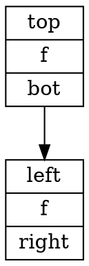
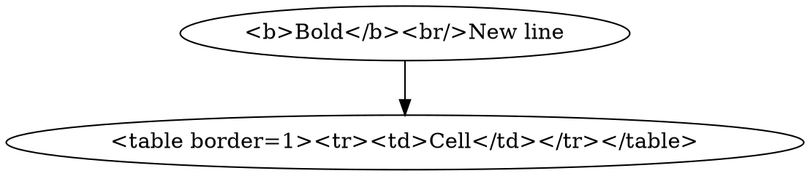
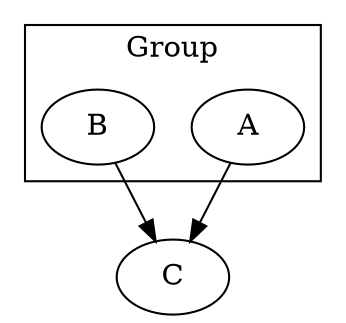
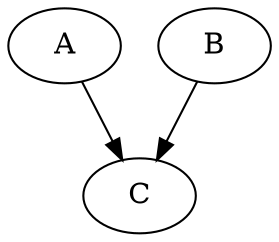
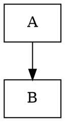
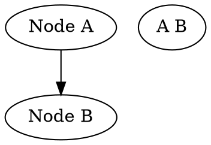
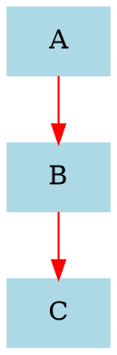
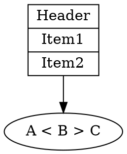

# graphviz (render_diagram format `graphviz`)

## Rules (each checked against the renderer)
- Source is a `digraph name { ... }` (directed, `->`) or `graph name { ... }` (undirected, `--`). Statements end with `;` (optional but safest).
- Quote any identifier or label containing spaces or punctuation: `"Auth Service" -> "User DB";`.
- `record` shapes: fields are separated by `|`, nested fields use `{ }`, ports use `<port>`; **escape literal `{ } | < >` with a backslash** inside a record label. Edges can target a port: `a:p1 -> b:p2`.
- Group nodes with `subgraph cluster_x { label="..."; ... }` (the name must start with `cluster`). Force a row with `{ rank=same; a; b; }`.
- Defaults: `node [shape=box, style=filled, fillcolor="#eef"]; edge [color=gray];` before the nodes they apply to.
- HTML-like labels use `<...>` instead of quotes: `a [label=<<b>bold</b> line two>];`.

## Identifiers
When an identifier exists, use it as the node id and the display name as the label: `"00000000-...02" [label="engine"];`. Never invent identifiers.

## Verified examples (all render)
### record-ports

### html-labels

### clusters

### rank-same

### edge-ports

### quoted-ids

### default-attrs

### escape-chars

