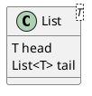
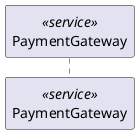
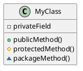
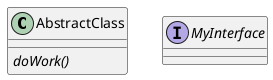
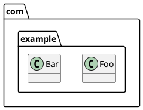
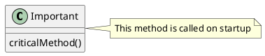
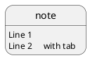

# plantuml (render_diagram format `plantuml`)

## Rules (each checked against the renderer, 2026-10-01)
- **Every source must start with `@startuml` and end with `@enduml`.** Without the wrapper the renderer fails with `Syntax Error? (Assumed diagram type: sequence)` (seen in real runs).
- Class diagrams: `class Name { +publicField : Type ; -privateMethod() }`, `abstract class`, `interface`, `enum`; relationships `<|--` (inherits), `*--` (composition), `o--` (aggregation), `-->` (association), `..>` (dependency); labels after a colon.
- Generics go in angle brackets on the class name: `class Box<T>`; stereotypes use guillemets: `class A <<Entity>>`.
- Group with `package "Name" { ... }`; attach text with `note right of A : text` or `note "text" as N1`.
- Style with `skinparam` lines before the elements; `hide empty members` removes empty compartments.
- A line PlantUML cannot place gives `Syntax Error? (Assumed diagram type: class) (line: N)`: fix that line, do not rewrite everything.

## Identifiers
When an identifier exists, keep it as the element alias and the display name as its title: `class "Engine" as e0002`. Never invent identifiers.

## Verified examples (all render)
### generics

### stereotypes

### visibility

### abstract-interface

### packages

### notes

### escaping

### skinparam

```plantuml
@startuml
skinparam class {
  BackgroundColor lightblue
  BorderColor blue
}
class StyledClass
@enduml
```

### hide-empty-members

```plantuml
@startuml
hide empty members
class Empty
@enduml
```

