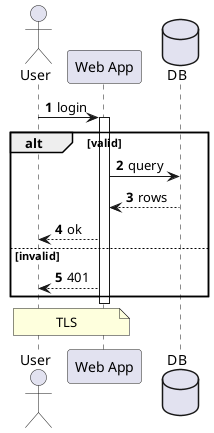
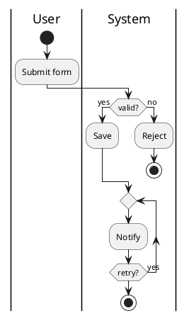
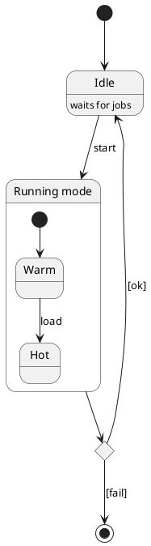
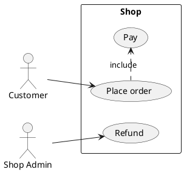
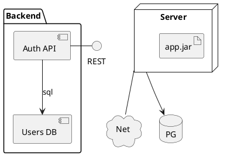
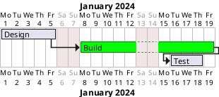
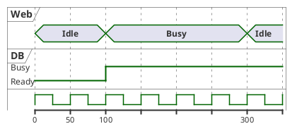
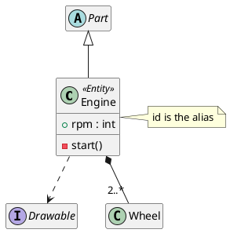

# plantuml (render_diagram format `plantuml`)

## Rules (each checked against the renderer)
- The renderer wraps plain source in `@startuml ... @enduml` for you, but write the wrapper anyway. **Gantt must use `@startgantt ... @endgantt`**: gantt lines inside `@startuml` fail with `Syntax Error? (Assumed diagram type: sequence) (line: 1)`. `@startmindmap`/`@startwbs` also render.
- A bad line gives `Syntax Error? (Assumed diagram type: <type>) (line: N)`: the type shows what PlantUML guessed; fix line N, do not rewrite everything.
- **Names with spaces or hyphens must be declared with a quoted alias**: `participant "Web App" as W`, `state "Idle mode" as s1`, `class "Engine" as e2`. Bare `Web App -> DB`, `class My Class`, `participant my-w` and `[*] --> my-state` all fail; `class my-class` rendered.
- Sequence: `A -> B : msg`, `-->` dotted return, `->>` async, `activate`/`deactivate`, `alt x ... else y ... end`, `loop`, `opt`, `group`, `autonumber`, `note right of B : t`, `note over A,B : t`.
- Activity (new syntax): `start`, `:action;`, `if (c?) then (yes) ... else (no) ... endif`, `while (c?) ... endwhile`, `repeat ... repeat while (c?)`, `fork ... fork again ... end fork`, `|Lane|` swimlanes, `partition "P" { }`, `stop`. **Every action needs the closing `;`** (`:Read input` fails).
- State: `[*] --> A`, `A --> B : event`, nested `state X { ... }`, `state f <<fork>>`, `<<choice>>`, `A : description`. Use case: `actor U`, `usecase "Login" as UC1`, `(Logout) as UC2`, `rectangle Sys { }`, `.>` for include/extend labels.
- Component/deployment: `[Svc A] --> [Svc B]`, `component`, `interface`, `package`, `node`, `cloud`, `database`, `artifact`, nesting in braces.
- Timing: `concise "Web" as W`, `robust`, `binary`, `clock clk with period 50`, `@0` / `W is Idle`, `@100`.
- Gantt: `Project starts 2024-01-01` (needed for absolute dates, else `No starting date for the project`), `[Design] lasts 5 days`, `[Build] starts at [Design]'s end`, `then [Test] lasts 3 days`, `[A] is colored in Lime/Green`, `saturday are closed`. A reference to a missing task fails: `No such task Ghost`; `[B] starts after [A]` fails.
- Class: `class A { +f : T }`, `abstract class`, `interface`, `enum`, `<|--`, `*--`, `o--`, `-->`, `..>`, generics `class Box<T>`, `<<Entity>>`, `package "P" { }`, `hide empty members`, `skinparam` lines first.

## Identifiers
When an identifier exists (SysML v2 element id, schema.table, namespace/kind/name) use it as the alias and the display name as the quoted title: `class "Engine" as e0002`, `participant "Web App" as w0001`, `state "Idle mode" as s0001`. Never invent identifiers.

## Verified examples (all render)
### sequence

### activity

### state

### use case

### component and deployment

### gantt

### timing

### class with id alias

