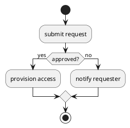

# Skill: activity / flow diagrams (PlantUML activity, D2 flowchart)

Good at: process steps, decision branches, swimlanes. Bad at: message order
between participants (prefer sequence).

Gotchas:
- PlantUML activity: `start`/`stop`, `if (...) then ... else ... endif`,
  `fork` for parallel lanes, `partition` or `|Swimlane|` for ownership.
- D2 flowchart: `a -> b: label`; shape via `a: {shape: decision}`; direction
  `direction: down` keeps long flows readable.
- Keep one decision per diamond — merge branches explicitly.

Minimal correct sample (PlantUML):

Render: POST source to `/render/plantuml` (or `/render/d2` for D2).
