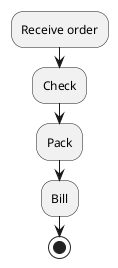
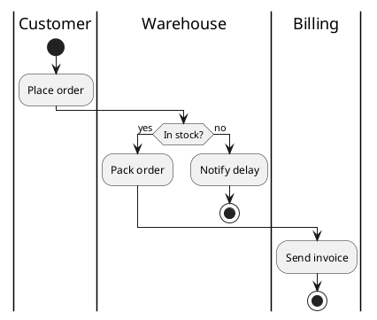

# Skill: Activity diagram (`activity`, format `plantuml`)

## Choose it when
- The reader wants to know who does what, in what order, across several roles or systems.
- A workflow has real branching, parallel work (fork/join), or loops.
- You need to show where responsibility passes from one party to another.

## Not when
- It is a single-actor sketch with no ownership question: use `flowchart`.
- The focus is exchanged messages between systems over time: use `sequence`.
- The focus is states of one object: use `state`.

## Anatomy
- An action (`:Do something;`) is one unit of work.
- A diamond (`if`) is a decision with labelled branches; `endif` is the merge.
- `fork` / `end fork` splits into parallel paths that must all complete before continuing.
- Swimlanes (`|Role|`) assign each action to a role or system.
- `start` and `stop` bound the flow.

## What makes it good
- Lanes are actors (roles or systems), not departments or arbitrary groups; keep to about 2-4.
- Every action is verb-first and short; every decision has two labelled exits that merge again.
- Parallel work uses fork/join only when the steps are truly concurrent.
- One workflow per diagram, with a single start and clear stop.
- Where identifiers exist (ticket id, element id), use them as keys in notes, not as action text.

## What makes it bad
- Lanes that are never used, or an action sitting in the wrong lane.
- Decisions with only one exit drawn, or branches that never merge or stop.
- Fork without a join, so it is unclear when work is complete.
- Long sentences, or pasted code and field lists inside actions.
- Detail from several levels (UI click and annual audit) in one chart.

## Questions to ask
- Who are the participants (people or systems) that perform steps?
- Which decisions can change the path, and what are the outcomes?
- Does any work happen in parallel, and what must finish before the next step?

## Contrast
Bad:

```plantuml
@startuml
:Receive order;
:Check;
:Pack;
:Bill;
stop
@enduml
```
Good:

```plantuml
@startuml
|Customer|
start
:Place order;
|Warehouse|
if (In stock?) then (yes)
  :Pack order;
else (no)
  :Notify delay;
  stop
endif
|Billing|
:Send invoice;
stop
@enduml
```
The good version assigns each action to an owner, labels the decision, and ends every path.
