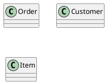
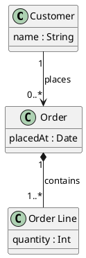

# Skill: Class diagram (`class`, format `plantuml`)

## Choose it when
- The reader wants to know what types exist in a domain, what they hold, and how they relate.
- Inheritance, composition, or multiplicities (one-to-many) need to be explicit.
- You are designing or documenting a domain model or an API's data types.

## Not when
- The subject is database tables and keys: use `erd`.
- The subject is runtime behaviour: use `sequence` or `state`.
- The subject is system-level building blocks: use `component`.

## Anatomy
- A class box has a name, fields (attributes), and optionally methods.
- Inheritance (`--|>`) means "is a"; composition (`*--`) and aggregation (`o--`) mean "has a" with different lifetimes.
- A plain association (`-->`) means one refers to the other; label the role and multiplicity.
- Interfaces and abstract classes are marked as such.
- Packages group related types.

## What makes it good
- Show only the fields and methods that serve the question; hiding the rest is fine.
- Name classes with domain nouns in singular form.
- Label every association with a role name and multiplicity ("1", "0..*").
- Inheritance goes top-down, with the parent above; the layout shows the hierarchy.
- About 5-12 classes per diagram; where identifiers exist, keep them as aliases and display names as labels.

## What makes it bad
- Every field and getter listed, which hides the structure.
- Associations with no multiplicity or role, so cardinality is guesswork.
- Inheritance used where composition is meant (communities differ, but "is a" must be true).
- Mixed level: framework internals next to domain concepts.
- Duplicate classes for the same concept, or isolated classes with no relations.

## Questions to ask
- Which concepts matter for the reader, and what do they hold?
- How do they relate: is-a, has-a, or just refers-to, and how many?
- Is this a domain model, or the code's actual classes?

## Contrast
Bad:

Good:

The good version adds fields, relationships, roles and multiplicities, so the types now form a model.
