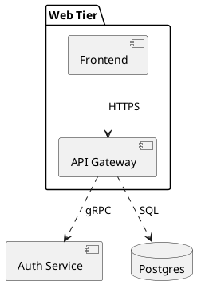

# Skill: component diagrams (PlantUML, C4-PlantUML)

Good at: system structure, interfaces between building blocks. Bad at: time
order (prefer sequence).

Gotchas:
- PlantUML: `component`, `interface`, `package` for grouping; `..>` dashed
  dependency arrows read better than solid for "uses".
- C4-PlantUML (via `c4plantuml` format): `C4_Context`, `Container`,
  `Component` macros; `System_Boundary` for the scope box.
- Label arrows with the protocol/contract ("REST", "gRPC"), not verbs.

Minimal correct sample:

Render: POST source to `/render/plantuml` (or `/render/c4plantuml`).
