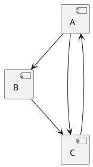
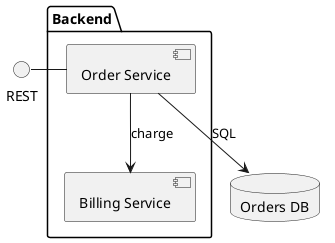

# Skill: Component diagram (`component`, format `plantuml`)

## Choose it when
- The reader wants to know what the building blocks of a system are and how they depend on each other.
- Interfaces or contracts between modules need to be visible.
- You are explaining module boundaries to developers.

## Not when
- The audience is non-technical and wants the system in its environment: use `c4-context`.
- The question is runtime message order: use `sequence`.
- You need fields and inheritance of types: use `class`.

## Anatomy
- A component is a replaceable module with a clear responsibility.
- An interface (lollipop or `interface`) is what a component offers.
- An arrow is a dependency: the tail uses the head. Label it with what is used or the protocol.
- A package or nesting groups components in a layer or deployable unit.
- External systems may appear as components marked outside the main grouping.

## What makes it good
- One level of abstraction: all boxes are comparable in size and kind.
- About 5-12 components; split by layer or subsystem beyond that.
- Dependencies point one way (for example UI to service to storage); cycles are flagged, not hidden.
- Every arrow has a label (call, SQL, event) or an interface name.
- Names come from the code or architecture docs; identifiers stay as aliases and names as labels.

## What makes it bad
- Mixing levels (a class next to a whole platform).
- Arrows from everything to everything, so structure is invisible.
- Unlabelled arrows that do not say what the dependency is.
- Technology logos or deployment details (servers, networks) mixed in without need.
- Components named by team or ticket instead of responsibility.

## Questions to ask
- What are the main modules, and what is each responsible for?
- Which dependencies cross a boundary and need an interface name?
- Who is the audience: developers or stakeholders?

## Contrast
Bad:

```plantuml
@startuml
[A] --> [B]
[A] --> [C]
[B] --> [C]
[C] --> [A]
@enduml
```
Good:

```plantuml
@startuml
package "Backend" {
  [Order Service] as orders
  [Billing Service] as billing
}
database "Orders DB" as db
interface REST
REST - orders
orders --> billing : charge
orders --> db : SQL
@enduml
```
The good version groups components, names their responsibilities, exposes an interface, and labels each dependency.
