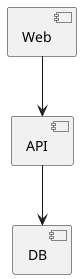
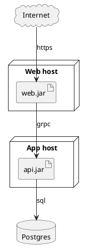

# Skill: Deployment diagram (`deployment`, format `plantuml`)
## Choose it when
- The reader asks what runs where: which artifact or service sits on which machine, cluster or cloud.
- You need to show the physical or runtime boundaries between environments.
- Operators or reviewers must see where data stores and external services live.
## Not when
- The question is how the code is split into components and interfaces: use `component`.
- The question is an ordered conversation between services: use `sequence`.
- The runtime is a Kubernetes cluster you can read from manifests: use `k8s-topology`.
## Anatomy
- A node is a machine, VM, container host or cloud region; it contains what runs on it.
- An artifact is a deployable thing (a jar, an image, a binary) placed inside a node.
- A database or cloud shape marks stores and external services.
- A link between nodes is a network path; its label names the protocol.
## What makes it good
- One environment per diagram (production, or staging), stated in the title.
- Nesting shows containment: artifacts inside nodes, nodes inside zones or regions.
- Links carry protocol or port labels (`https`, `sql`), not just lines.
- Data stores and third-party services are visibly distinct from your own artifacts.
- Where identifiers exist (namespace/kind/name), use them as the alias and the display name as the quoted title.
## What makes it bad
- Mixing logical components with physical nodes in one picture.
- Unlabelled links, so the reader cannot tell traffic from dependency.
- Every instance of a replicated service drawn individually instead of noted once with a count.
- Nodes with no artifacts, or artifacts floating outside any node.
- Diagrams that go out of date because they list versions or IPs that change.
## Questions to ask
- Which environment, and what are the nodes or zones?
- What runs on each node, and which parts are stores or third parties?
- Which network paths and protocols should be shown?
## Contrast
Bad:

Good:

The good version places artifacts on named nodes, separates the database, and labels each link with its protocol.
