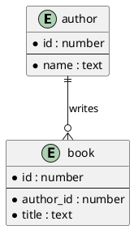

# Skill: entity-relationship diagrams (PlantUML ER, DBML)

Good at: entities, cardinality, foreign keys. Bad at: behaviour.

Gotchas:
- PlantUML ER: `entity` blocks + `||--o{` crow's-foot lines (one-to-many),
  `||--||` one-to-one, `}o--o{` many-to-many.
- DBML: `Table { column type [pk] }`, `Ref: a.id > b.author_id`.
- Name relationships with a verb phrase on the line label.

Minimal correct sample (PlantUML):

Render: POST source to `/render/plantuml` (or `/render/dbml` for DBML).
