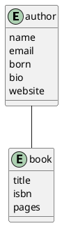
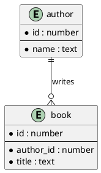

# Skill: Entity-relationship diagram (`erd`, format `plantuml`)

## Choose it when
- The reader wants to know which things the data model holds and how they reference each other.
- Someone must agree on cardinality (one author, many books) before tables are built.
- A conceptual or logical model is being reviewed, not a physical schema with types and indexes.

## Not when
- You need exact column types, defaults and foreign-key constraints for a real database: use `dbml`.
- The question is how data moves or in what order things happen: use `sequence` or `activity`.
- You are showing classes with behaviour (methods): use a class diagram, not an ERD.

## Anatomy
- An entity is a thing the business tracks; it is drawn as a box with its attributes.
- A key attribute (marked `*` for mandatory, above the `--` divider for the identifier) identifies one instance.
- A relationship line joins two entities; crow's-foot ends give cardinality (`||` exactly one, `o{` zero or many).
- The line label is a verb phrase read from left to right ("author writes book").
- Optional versus mandatory is carried by the `o` (zero) on the line end.

## What makes it good
- Keep it to roughly 5-12 entities; split a bigger model by subject area, one diagram per area.
- Every entity shows its identifier and only the attributes that matter to the question, not every column.
- Every relationship has a verb label and explicit cardinality on both ends.
- Name entities with singular nouns in one casing style, and keep that style across the whole diagram.
- Place parents above or left of children so the lines read in one direction. When an identifier exists (schema.table), keep it as the entity name and put the display name in a label or note.

## What makes it bad
- Entities with no key, so nobody knows what makes a row unique.
- Plain unlabelled lines with no cardinality, which say only "related somehow".
- Every column of every table listed, burying the structure.
- Many-to-many drawn directly with no thought for the join entity when it carries its own data (dates, quantity).
- Mixing in behaviour, flows or deployment details that belong in other diagram types.

## Questions to ask
- Which entities matter, and what uniquely identifies each one?
- For each pair that connects: one-to-many, many-to-many, and is the link optional?
- Is this a concept-level picture for discussion, or a detailed model for building a database?

## Contrast
Bad:

```plantuml
@startuml
entity "author" as a {
  name
  email
  born
  bio
  website
}
entity "book" as b {
  title
  isbn
  pages
}
a -- b
@enduml
```
Good:

```plantuml
@startuml
entity "author" as a {
  * id : number
  --
  * name : text
}
entity "book" as b {
  * id : number
  --
  * author_id : number
  * title : text
}
a ||--o{ b : writes
@enduml
```
The good version adds identifiers, drops incidental attributes, and states cardinality with a verb ("author writes book", one to many).
