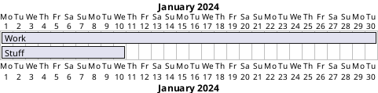
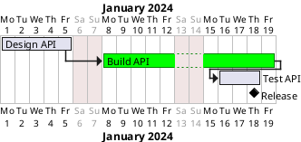

# Skill: Gantt chart (`gantt`, format `plantuml`)
## Choose it when
- The reader asks who or what is scheduled when, and which tasks block which.
- A plan has dependencies and a fixed start, and the finish date matters.
- You need to show durations side by side across weeks or months.
## Not when
- Only a few dated events matter, with no durations: use `timeline`.
- The question is the order of steps in a process, not dates: use `flowchart`.
- The question is signal timing in milliseconds: use `timing`.
## Anatomy
- A bar is one task; its length is its duration.
- A dependency (`starts at [A]'s end`) places a task after another, so slips propagate.
- A milestone is a zero-length marker for a decision or delivery.
- Colour groups tasks by phase or owner; closed days (weekends) are skipped.
## What makes it good
- A project start date is set, so dates are real, not relative.
- Tasks are named with a verb and an object (`Build API`); ten to twenty tasks at most.
- Dependencies are expressed, not implied by placement, so the chain is checkable.
- Milestones mark the dates people are held to.
- Colour means one thing (phase or owner) and is used consistently; where identifiers exist, keep them as the key and the name as the label.
## What makes it bad
- Bars placed by eye with no dependencies, so the schedule cannot be re-derived.
- Fifty tasks on one chart, which hides the critical path.
- Durations without a basis, shown as precise dates (conventional practice varies on how much precision to show).
- Vague task names such as "Phase 2" or "Misc".
- No milestones, so the reader cannot tell what done looks like.
## Questions to ask
- What are the main tasks, how long does each take, and what blocks what?
- When does the work start, and is there a fixed end date?
- Which dates or milestones must be visible?
## Contrast
Bad:

Good:

The good version names tasks by verb and object, chains them with dependencies, closes weekends, and ends in a milestone.
