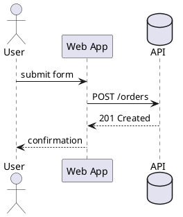

# Skill: sequence diagrams (PlantUML)

Good at: who-calls-whom in time order, request/response handoffs, protocol
exchanges. Bad at: decision branches (prefer activity), structure (prefer
component/class).

Gotchas:
- Participants: `actor`, `participant`, `boundary`, `control`, `entity`,
  `database` — pick the shape that matches the thing's role.
- Sync (solid arrow `->`) vs return (dashed `-->`); async is `->>` / `-->>`.
- Group with `== sections ==` and `alt/else/end` for branches.
- `autonumber` for protocol-style numbering.

Minimal correct sample:

Render: POST source to `/render/plantuml` (outputs svg/png).
