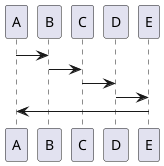
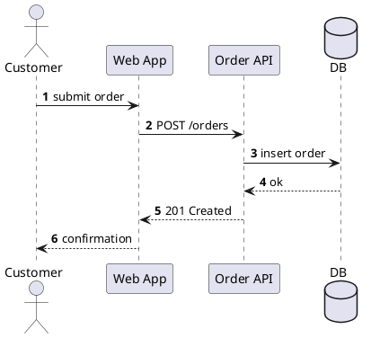

# Skill: Sequence diagram (`sequence`, format `plantuml`)

## Choose it when
- The reader wants to know who talks to whom, in what order, for one scenario.
- You are documenting an API call, handshake, or login flow between systems.
- Timing, retries, or who waits for whom matter.

## Not when
- The question is about decisions and ownership of steps: use `activity`.
- The question is system structure, not behaviour: use `component` or `c4-context`.
- It is a lifecycle of one object: use `state`.

## Anatomy
- Participants (across the top) are actors or systems; each has a vertical lifeline.
- Solid arrows are calls or messages; dashed arrows are returns or replies.
- Vertical position is time; earlier is higher.
- `activate` bars show when a participant is busy handling a call.
- `alt`/`else`, `opt`, and `loop` frames show conditions and repetition.

## What makes it good
- One scenario per diagram (the happy path), with failures as a separate diagram or a small `alt`.
- Keep to about 3-6 participants, ordered left to right by first appearance.
- Messages are named for intent or operation ("Create order", `POST /orders`), not for internals.
- Returns are drawn only where they carry information the reader needs.
- Use `autonumber` when the text refers to steps; identifiers stay as aliases with display names as labels.

## What makes it bad
- Too many participants, so arrows run across the whole page.
- Every internal method call drawn, hiding the interaction that matters.
- Several scenarios mixed with nested `alt` frames five deep.
- Unlabelled arrows, or labels that describe the response data in full.
- Participants that never send or receive anything.

## Questions to ask
- Which scenario do we draw, and what triggers it?
- Which systems or people take part, and which of them matter to the reader?
- Is there a failure or retry case that must be shown?

## Contrast
Bad:

```plantuml
@startuml
A -> B
B -> C
C -> D
D -> E
E -> A
@enduml
```
Good:

```plantuml
@startuml
actor Customer
participant "Web App" as web
participant "Order API" as api
database DB
autonumber
Customer -> web : submit order
web -> api : POST /orders
api -> DB : insert order
DB --> api : ok
api --> web : 201 Created
web --> Customer : confirmation
@enduml
```
The good version names its participants and messages, uses returns, and tells one scenario in time order.
