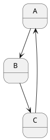
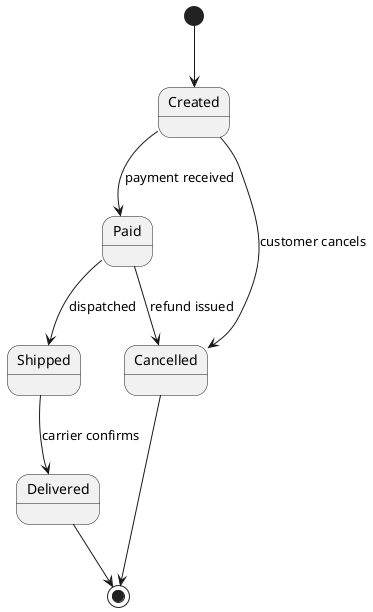

# Skill: State machine (`state`, format `plantuml`)

## Choose it when
- The reader wants to know what states one thing can be in and what moves it between them.
- Rules like "an order cannot be shipped before it is paid" must be visible.
- You are specifying a lifecycle (order, session, device) or checking for missing transitions.

## Not when
- The subject is a process with steps across roles: use `activity`.
- The point is the order of messages between parties: use `sequence`.
- You need data structure: use `class`.

## Anatomy
- A state is a condition the thing stays in for a while (a noun or adjective: Paid, Idle).
- A transition arrow `A --> B : event [guard] / action` says what triggers the move.
- `[*]` is the initial pseudostate; an arrow to `[*]` ends the lifecycle.
- A composite state nests sub-states for a mode with its own internal flow.
- A choice (`<<choice>>`) shows a branch decided by a guard condition.

## What makes it good
- One subject per diagram (a single order, not "the system").
- State names are conditions, not actions; transition labels are events (past tense or noun).
- Every non-final state has an exit, and unusual paths (cancel, timeout, failure) are drawn.
- Guards are written on transitions when the same event has several outcomes.
- Keep to roughly 4-10 states; group with composites beyond that. Identifier-keyed states keep id as alias, name as label.

## What makes it bad
- States that are really steps ("Validate input"), so it is a flowchart in disguise.
- Missing initial state, or states with no way in or out.
- Transitions with no event label, or identical events leaving one state with no guards.
- One diagram trying to cover several objects' lifecycles at once.
- A transition from every state to every other, which means the states are not real.

## Questions to ask
- What exactly is the thing whose lifecycle we draw, and how does it begin and end?
- What events change its state, including failures and cancellations?
- Are there rules that forbid some transitions?

## Contrast
Bad:

Good:

The good version names real conditions, labels each event, adds a start and ends, and includes the cancellation paths.
