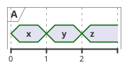
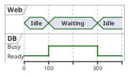

# Skill: Timing diagram (`timing`, format `plantuml`)
## Choose it when
- The reader asks what state each part is in at each moment, and how changes line up across parts.
- You need to show who is waiting on whom, or how long a state lasts.
- Two to five actors change state on a shared timeline.
## Not when
- You care about the order of messages, not durations: use `sequence`.
- You need clock-accurate digital signals with edges and buses: use `wavedrom`.
- You need tasks with dependencies over days or weeks: use `gantt`.
## Anatomy
- Each lane is one actor or signal; its title names it.
- A lane's line shows its current state; a change happens at a time marker (`@100`).
- Kinds: `concise` (named states in a ribbon), `robust` (named states on levels), `binary` (high or low), `clock`.
- Lanes share one time axis, so vertical alignment means simultaneity.
## What makes it good
- Time unit is stated or obvious (ticks, ms) and consistent across lanes.
- Two to five lanes; each tells a different part of the story.
- State names are short and the same on every occurrence.
- Interesting moments, such as a handoff or a timeout, are visible at a time marker, not buried.
- Where identifiers exist, use them as the alias and the display name as the quoted title.
## What makes it bad
- Dozens of lanes that cannot be read together.
- Time markers at irregular, unexplained intervals.
- State names that change spelling between occurrences.
- Using a timing diagram for ordered conversation, where `sequence` is the better fit.
- No clue to what a state means, so the reader cannot judge whether the timing is correct.
## Questions to ask
- Which actors or signals are in scope, and what states can each be in?
- Over what time span, and in what unit?
- Which moment or handoff is the point of the diagram?
## Contrast
Bad:

Good:

The good version shows two actors on a shared axis with named states, so the waiting-while-busy overlap is visible.
