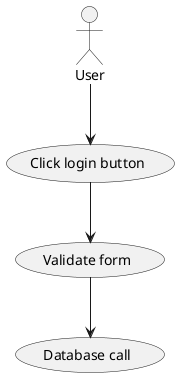
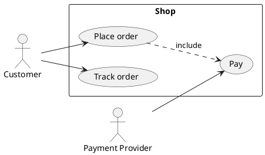

# Skill: Use case diagram (`use-case`, format `plantuml`)

## Choose it when
- The reader wants to know who uses the system and what goals it supports.
- You are scoping a system boundary: what is in, what is outside.
- Stakeholders need a one-page overview of capabilities before detail is designed.

## Not when
- The question is how a goal is achieved step by step: use `sequence` or `activity`.
- You need system structure: use `component` or `c4-context`.
- You are showing one object's lifecycle: use `state`.

## Anatomy
- Actors (stick figures) are roles outside the system, human or external systems.
- Use cases (ovals) are goals an actor achieves, named verb + noun.
- The system boundary (rectangle) contains the use cases; actors sit outside.
- An association line links an actor to a goal it pursues.
- include (always part of) and extend (optional variation) relate use cases; use them sparingly.

## What makes it good
- Use case names state a user goal ("Place order"), not a function ("Order controller").
- Actors are roles, not named people; the same person in two roles is two actors.
- One boundary, labelled with the system name; about 5-9 use cases at one level of detail.
- Primary actors on the left, supporting systems on the right (a common convention).
- Where identifiers exist (requirement or element ids), keep them as keys and the display name as the label.

## What makes it bad
- Use cases that are really steps ("Click button", "Validate form").
- Deep include/extend trees that turn the diagram into a flowchart.
- Actors placed inside the boundary, or database and UI components drawn as actors.
- Mixing levels: "Manage everything" next to "Reset password".
- Lines from every actor to every case, so the picture shows nothing about who does what.

## Questions to ask
- Who or what interacts with the system from outside?
- What is each of them trying to achieve?
- Where does the system end: which capabilities are out of scope?

## Contrast
Bad:

Good:

The good version uses goals instead of steps, puts a boundary around them, and shows who is outside it.
